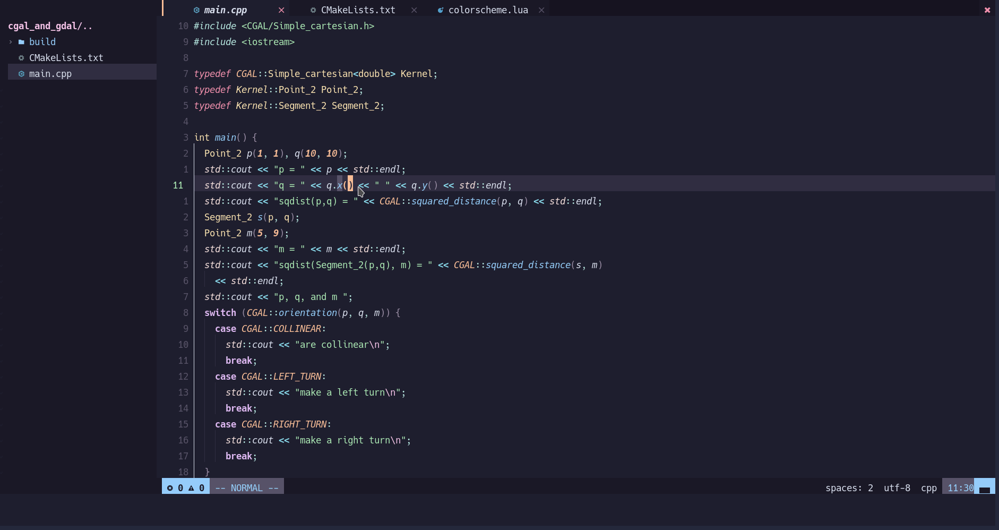
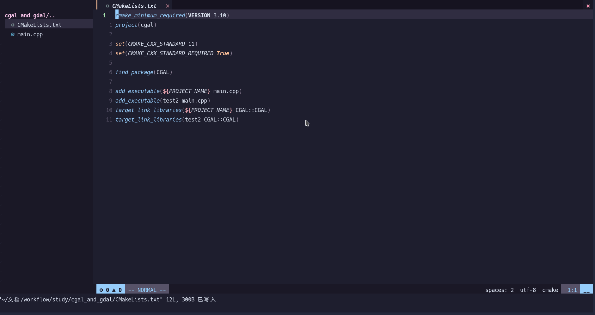
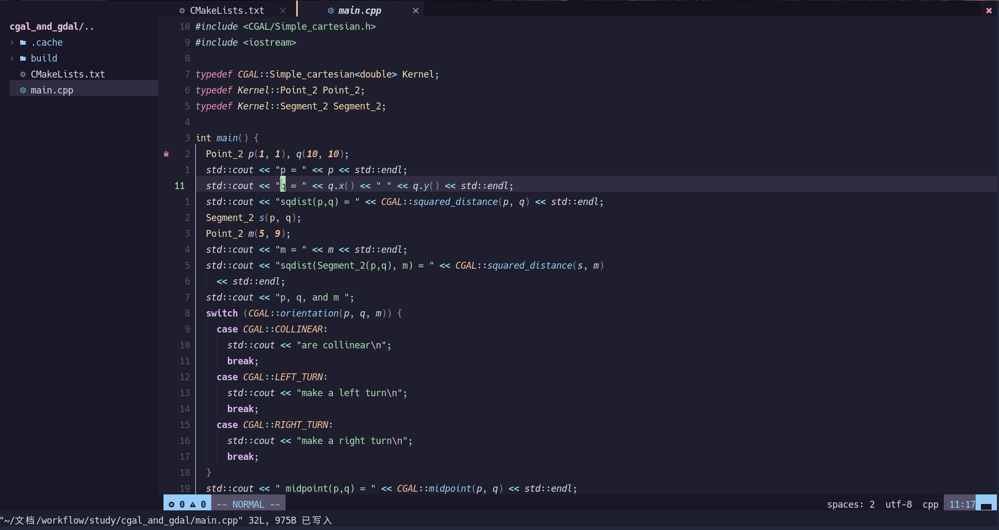
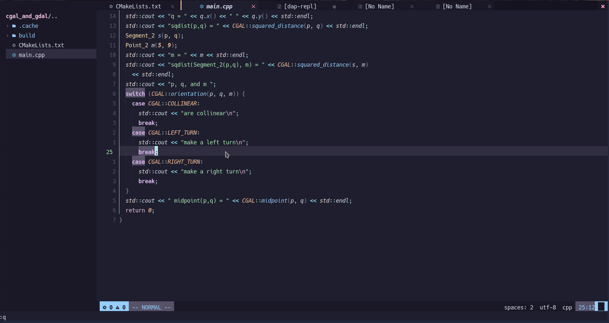
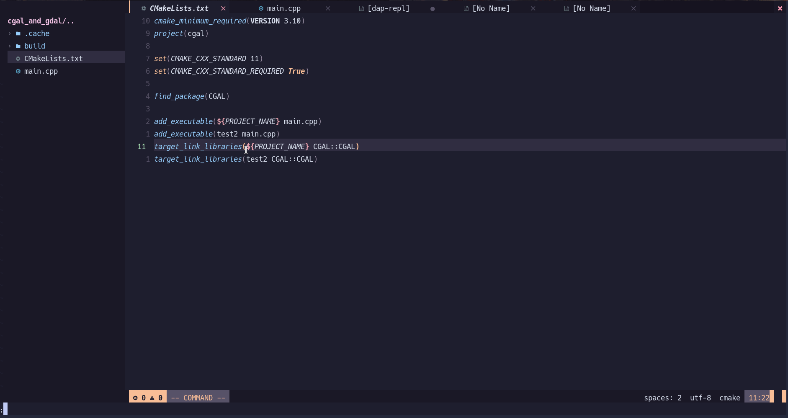

# CMake Tools for Neovim

🔥CMake Tools for Neovim written in pure lua that requires Neovim 0.7+.🔥

It uses [CMake file api](https://cmake.org/cmake/help/latest/manual/cmake-file-api.7.html) to generate CMake file structure.

It uses terminal to execute targets.

(optional) It uses [nvim-dap](https://github.com/mfussenegger/nvim-dap) to debug.

## Installation

- Require Neovim (>=0.7)
- Require [plenary](https://github.com/nvim-lua/plenary.nvim)
- Install it like any other Neovim plugin.
  - [packer.nvim](https://github.com/wbthomason/packer.nvim): `use 'Civitasv/cmake-tools.nvim'`
  - [vim-plug](https://github.com/junegunn/vim-plug): `Plug 'Civitasv/cmake-tools.nvim'`

Todo: Add help.txt

## Usage

|Command|Description|
|-|-|
|CMakeGenerate\[!\]|Generate native makefiles and workspaces that can be used next. Additional arguments will be passed to CMake.|
|CMakeBuild| Build target, if not generate makefiles yet, it will automatically invoke `CMake`, if not select build target, it will automatically invoke `CMakeSelectBuildTarget` . Additional arguments will be passwd to CMake.|
|CMakeRun|Run launch target, if not generate makefiles yet, it will automatically invoke `CMakeGenerate`, if not select launch target, it will automatically invoke `CMakeSelectLaunchTarget`, if not built, it will automatically invoke `CMakeBuild`. Additional arguments will be passed to `CMakeGenerate` and `CMakeBuild`. |
|CMakeDebug|Use nvim-dap to debug launch target, works like CMakeRun|
|CMakeSelectBuildType|Select build type, include  "Debug", "Release", "RelWithDebInfo", "MinSizeRel" |
|CMakeSelectBuildTarget|Select build target, include executable and library targets |
|CMakeSelectLaunchTarget|Select launch target, only include executable targets |
|CMakeOpen|Open CMake console|
|CMakeClose|Close CMake console|
|CMakeInstall|Install CMake targets. Additional arguments will be passed to CMake.|
|CMakeClean|Clean target|
|CMakeStop|Stop CMake process|

## Demos

### CMakeGenerate


### CMakeBuild



### CMakeRun



### CMakeDebug (require nvim-dap)



### CMakeSelectBuildType



### CMakeSelectBuildTarget


### CMakeSelectLaunchTarget



## Setup

```lua
require("cmake-tools").setup {
  cmake_command = "cmake",
  cmake_build_directory = "build",
  cmake_build_type = "Debug",
  cmake_generate_options = { "-D", "CMAKE_EXPORT_COMPILE_COMMANDS=1" },
  cmake_build_options = {},
  cmake_console_size = 10, -- cmake output window height
  cmake_show_console = "always", -- "always", "only_on_error"
  cmake_dap_configuration = { name = "cpp", type = "codelldb", request = "launch" }, -- dap configuration, optional
  cmake_dap_open_command = require("dap").repl.open, -- optional
}
```

## LICENCE

[GPL-3.0 License](https://www.gnu.org/licenses/gpl-3.0.html) © Civitasv
