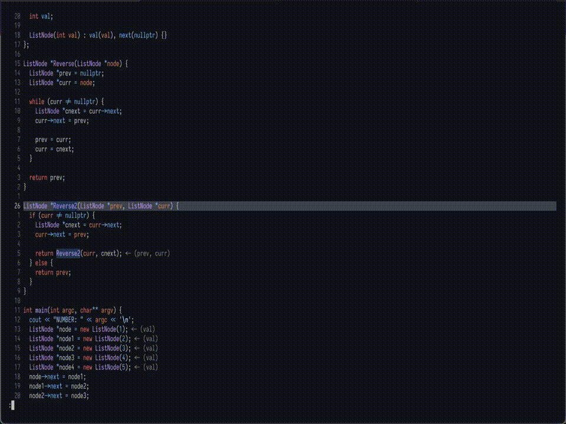

# CMake Tools

<p align="center"></p>

<h2 align="center">🔥CMake Tools for Neovim which is written in pure lua.🔥</h2>

> CREDIT:
>
> It is a fork from the brilliant [neovim-cmake](https://github.com/Shatur/neovim-cmake). Since I change too much of it, So I make a new repo to develop it.

The goal of this plugin is to offer a comprehensive, convenient, and powerful workflow for CMake-based projects in Neovim, comparable to the functionality provided by [vscode-cmake-tools](https://github.com/microsoft/vscode-cmake-tools) for Visual Studio Code.

## :sparkles: Installation

- Require Neovim (>=0.7).
- Require [plenary](https://github.com/nvim-lua/plenary.nvim).
- Allow integerating with [overseer](https://github.com/stevearc/overseer.nvim), optional, if you want this feature, please install it firstly.
- Allow integerating with [toggleterm](https://github.com/akinsho/toggleterm.nvim), optional, if you want this feature, please install it firstly.
- Install it like any other Neovim plugin.
  - [lazy.nvim](https://github.com/folke/lazy.nvim): `return { 'Civitasv/cmake-tools.nvim', opts = {} }`
  - [packer.nvim](https://github.com/wbthomason/packer.nvim): `use 'Civitasv/cmake-tools.nvim'`
  - [vim-plug](https://github.com/junegunn/vim-plug): `Plug 'Civitasv/cmake-tools.nvim'`

## :balloon: Configuration

```lua
local osys = require("cmake-tools.osys")
require("cmake-tools").setup {
  cmake_command = "cmake", -- this is used to specify cmake command path
  ctest_command = "ctest", -- this is used to specify ctest command path
  cmake_use_preset = true,
  cmake_regenerate_on_save = true, -- auto generate when save CMakeLists.txt
  cmake_generate_options = { "-DCMAKE_EXPORT_COMPILE_COMMANDS=1" }, -- this will be passed when invoke `CMakeGenerate`
  cmake_build_options = {}, -- this will be passed when invoke `CMakeBuild`
  -- support macro expansion:
  --       ${kit}
  --       ${kitGenerator}
  --       ${variant:xx}
  cmake_build_directory = function()
    if osys.iswin32 then
      return "out\\${variant:buildType}"
    end
    return "out/${variant:buildType}"
  end, -- this is used to specify generate directory for cmake, allows macro expansion, can be a string or a function returning the string, relative to cwd.
  cmake_soft_link_compile_commands = true, -- this will automatically make a soft link from compile commands file to project root dir
  cmake_compile_commands_from_lsp = false, -- this will automatically set compile commands file location using lsp, to use it, please set `cmake_soft_link_compile_commands` to false
  cmake_kits_path = nil, -- this is used to specify global cmake kits path, see CMakeKits for detailed usage
  cmake_variants_message = {
    short = { show = true }, -- whether to show short message
    long = { show = true, max_length = 40 }, -- whether to show long message
  },
  cmake_dap_configuration = { -- debug settings for cmake
    name = "cpp",
    type = "codelldb",
    request = "launch",
    stopOnEntry = false,
    runInTerminal = true,
    console = "integratedTerminal",
  },
  cmake_executor = { -- executor to use
    name = "quickfix", -- name of the executor
    opts = {}, -- the options the executor will get, possible values depend on the executor type. See `default_opts` for possible values.
    default_opts = { -- a list of default and possible values for executors
      quickfix = {
        show = "always", -- "always", "only_on_error"
        position = "belowright", -- "vertical", "horizontal", "leftabove", "aboveleft", "rightbelow", "belowright", "topleft", "botright", use `:h vertical` for example to see help on them
        size = 10,
        encoding = "utf-8", -- if encoding is not "utf-8", it will be converted to "utf-8" using `vim.fn.iconv`
        auto_close_when_success = true, -- typically, you can use it with the "always" option; it will auto-close the quickfix buffer if the execution is successful.
      },
      toggleterm = {
        direction = "float", -- 'vertical' | 'horizontal' | 'tab' | 'float'
        close_on_exit = false, -- whether close the terminal when exit
        auto_scroll = true, -- whether auto scroll to the bottom
        singleton = true, -- single instance, autocloses the opened one, if present
      },
      overseer = {
        new_task_opts = {
            strategy = {
                "toggleterm",
                direction = "horizontal",
                auto_scroll = true,
                quit_on_exit = "success"
            }
        }, -- options to pass into the `overseer.new_task` command
        on_new_task = function(task)
            require("overseer").open(
                { enter = false, direction = "right" }
            )
        end,   -- a function that gets overseer.Task when it is created, before calling `task:start`
      },
      terminal = {
        name = "Main Terminal",
        prefix_name = "[CMakeTools]: ", -- This must be included and must be unique, otherwise the terminals will not work. Do not use a simple spacebar " ", or any generic name
        split_direction = "horizontal", -- "horizontal", "vertical"
        split_size = 11,

        -- Window handling
        single_terminal_per_instance = true, -- Single viewport, multiple windows
        single_terminal_per_tab = true, -- Single viewport per tab
        keep_terminal_static_location = true, -- Static location of the viewport if avialable
        auto_resize = true, -- Resize the terminal if it already exists

        -- Running Tasks
        start_insert = false, -- If you want to enter terminal with :startinsert upon using :CMakeRun
        focus = false, -- Focus on terminal when cmake task is launched.
        do_not_add_newline = false, -- Do not hit enter on the command inserted when using :CMakeRun, allowing a chance to review or modify the command before hitting enter.
      }, -- terminal executor uses the values in cmake_terminal
    },
  },
  cmake_runner = { -- runner to use
    name = "terminal", -- name of the runner
    opts = {}, -- the options the runner will get, possible values depend on the runner type. See `default_opts` for possible values.
    default_opts = { -- a list of default and possible values for runners
      quickfix = {
        show = "always", -- "always", "only_on_error"
        position = "belowright", -- "bottom", "top"
        size = 10,
        encoding = "utf-8",
        auto_close_when_success = true, -- typically, you can use it with the "always" option; it will auto-close the quickfix buffer if the execution is successful.
      },
      toggleterm = {
        direction = "float", -- 'vertical' | 'horizontal' | 'tab' | 'float'
        close_on_exit = false, -- whether close the terminal when exit
        auto_scroll = true, -- whether auto scroll to the bottom
        singleton = true, -- single instance, autocloses the opened one, if present
      },
      overseer = {
        new_task_opts = {
            strategy = {
                "toggleterm",
                direction = "horizontal",
                autos_croll = true,
                quit_on_exit = "success"
            }
        }, -- options to pass into the `overseer.new_task` command
        on_new_task = function(task)
        end,   -- a function that gets overseer.Task when it is created, before calling `task:start`
      },
      terminal = {
        name = "Main Terminal",
        prefix_name = "[CMakeTools]: ", -- This must be included and must be unique, otherwise the terminals will not work. Do not use a simple spacebar " ", or any generic name
        split_direction = "horizontal", -- "horizontal", "vertical"
        split_size = 11,

        -- Window handling
        single_terminal_per_instance = true, -- Single viewport, multiple windows
        single_terminal_per_tab = true, -- Single viewport per tab
        keep_terminal_static_location = true, -- Static location of the viewport if avialable
        auto_resize = true, -- Resize the terminal if it already exists

        -- Running Tasks
        start_insert = false, -- If you want to enter terminal with :startinsert upon using :CMakeRun
        focus = false, -- Focus on terminal when cmake task is launched.
        do_not_add_newline = false, -- Do not hit enter on the command inserted when using :CMakeRun, allowing a chance to review or modify the command before hitting enter.
      },
    },
  },
  cmake_notifications = {
    runner = { enabled = true },
    executor = { enabled = true },
    spinner = { "⠋", "⠙", "⠹", "⠸", "⠼", "⠴", "⠦", "⠧", "⠇", "⠏" }, -- icons used for progress display
    refresh_rate_ms = 100, -- how often to iterate icons
  },
  cmake_virtual_text_support = true, -- Show the target related to current file using virtual text (at right corner)
}
```

Generally, the default is enough.

*And attention, when you firstly enter a new project, a session file for this project will be created, and `cmake_generate_options`, `cmake_build_options`, `cmake_build_directory` in your configuration will be used to initialize some fields of it. Then, if you reopen this project, it will reuse this session file to initialize these fields, or, you can think this project has its own settings, so if you change the values in global configuration, it will not reflect on these projects, you should refresh these fields by your own. Also see [session docs](./docs/sessions.md) and issue [#162](https://github.com/Civitasv/cmake-tools.nvim/issues/162).*

## :magic_wand: Docs

*Our plugin will automatically create a buffer named \*cmake-tools\*, all commands executed by this plugin will be dumped in this buffer, so when something goes wrong, you can know excatly what happend.*

1. [basic usage](./docs/basic_usage.md)
2. [settings](./docs/settings.md)
3. [executor and runner](./docs/executor_and_runner.md)
4. [all commands](./docs/all_commands.md)
5. [cmake presets](./docs/cmake_presets.md)
6. [cmake kits](./docs/cmake_kits.md)
7. [cmake variants](./docs/cmake_variants.md)
8. [sessions](./docs/sessions.md)
9. [how to](./docs/howto.md)

## :muscle: Contribute

If you want to implement a missing feature, [consider making a PR](./docs/contribute.md).

Optionally you can even add tests. We use [plenary test harness](https://github.com/nvim-lua/plenary.nvim#plenarytest_harness), as taken from [neotest-rust](https://github.com/rouge8/neotest-rust).
The tests run from inside a neovim instance, so `vim` and such are available.

## LICENCE

[GPL-3.0 License](https://www.gnu.org/licenses/gpl-3.0.html) © Civitasv

## Reference

1. [vscode-cmake-tools](https://github.com/microsoft/vscode-cmake-tools) is an amazing plugin for CMake-based project in Visual Studio Code, [MIT LICENSE](https://github.com/microsoft/vscode-cmake-tools/blob/main/LICENSE.txt).
2. Inspired by [neovim-cmake](https://github.com/Shatur/neovim-cmake) which is made by [Shatur](https://github.com/Shatur), [GPL-3.0 license](https://github.com/Shatur/neovim-cmake/blob/master/COPYING).
3. [plenary](https://github.com/nvim-lua/plenary.nvim), [MIT LICENSE](https://github.com/nvim-lua/plenary.nvim/blob/master/LICENSE).
