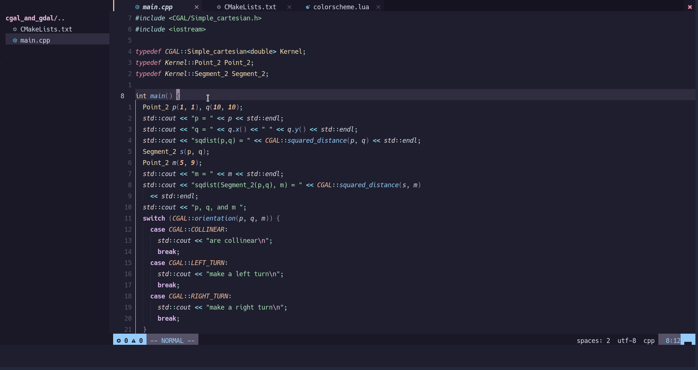

# CMake Tools for Neovim

> It is a fork from the brilliant [neovim-cmake](https://github.com/Shatur/neovim-cmake). Since I change too much of it, So I make a new repo to develop it.

🔥CMake Tools for Neovim written in pure lua that requires Neovim 0.7+.🔥

It uses [CMake file api](https://cmake.org/cmake/help/latest/manual/cmake-file-api.7.html) to generate CMake file structure.

It uses terminal to execute targets.

(optional) It uses [nvim-dap](https://github.com/mfussenegger/nvim-dap) to debug.

## New Feature

### CMake Build Directory Prefix

The option `cmake_build_directory_prefix` will be activated only when `cmake_build_directory` is set to "".

See detailed user scenario from issue [#21](https://github.com/Civitasv/cmake-tools.nvim/issues/21).

### CMake Presets

Not it supports `CMake[User]Presets.json`.

Attention: If `CMake[User]Presets.json` is provided, then `CMakeKits.json` or `CMakeVariants.[json|yaml]` won't have any effect.

### CMake Kits


And, It doesn't support Visual Studio currently.

### CMake Variants

Thanks @toolcreator for supporting CMake Variants which raised by VsCode's CMake Tools.


## Installation

- Require Neovim (>=0.7)
- Require [plenary](https://github.com/nvim-lua/plenary.nvim)
- Install it like any other Neovim plugin.
  - [packer.nvim](https://github.com/wbthomason/packer.nvim): `use 'Civitasv/cmake-tools.nvim'`
  - [vim-plug](https://github.com/junegunn/vim-plug): `Plug 'Civitasv/cmake-tools.nvim'`

Todo: Add help.txt

## Usage

| Command                 | Description                                                                                                                                                                                                                                                                                                            |
| ----------------------- | ---------------------------------------------------------------------------------------------------------------------------------------------------------------------------------------------------------------------------------------------------------------------------------------------------------------------- |
| CMakeGenerate\[!\]      | Generate native makefiles and workspaces that can be used next. Additional arguments will be passed to CMake. eg. Use `CMakeGenerate -G MinGW\ Makefiles` to specify another generator.                                                                                                                                |
| CMakeBuild              | Build target, if not generate makefiles yet, it will automatically invoke `CMake`, if not select build target, it will automatically invoke `CMakeSelectBuildTarget` . Additional arguments will be passed to CMake.                                                                                                   |
| CMakeRun                | Run launch target, if not generate makefiles yet, it will automatically invoke `CMakeGenerate`, if not select launch target, it will automatically invoke `CMakeSelectLaunchTarget`, if not built, it will automatically invoke `CMakeBuild`. Additional arguments will be passed to `CMakeGenerate` and `CMakeBuild`. |
| CMakeDebug              | Use nvim-dap to debug launch target, works like CMakeRun                                                                                                                                                                                                                                                               |
| CMakeSelectBuildType    | Select build type, include "Debug", "Release", "RelWithDebInfo", "MinSizeRel" for default. cmake-tools.nvim also support cmake variants, when "cmake-variants.yaml" or "cmake-variants.json" is provided, it will read configuration from it                                                                           |
| CMakeSelectBuildTarget  | Select build target, include executable and library targets                                                                                                                                                                                                                                                            |
| CMakeSelectLaunchTarget | Select launch target, only include executable targets                                                                                                                                                                                                                                                                  |
| CMakeOpen               | Open CMake console                                                                                                                                                                                                                                                                                                     |
| CMakeClose              | Close CMake console                                                                                                                                                                                                                                                                                                    |
| CMakeInstall            | Install CMake targets. Additional arguments will be passed to CMake.                                                                                                                                                                                                                                                   |
| CMakeClean              | Clean target                                                                                                                                                                                                                                                                                                           |
| CMakeStop               | Stop CMake process                                                                                                                                                                                                                                                                                                     |

## Demos

### CMakeGenerate



### CMakeBuild


### CMakeRun


### CMakeDebug (require nvim-dap)


### CMakeSelectBuildType


When `cmake-variants.json` or `cmake-variants.yaml` is provided:


### CMakeSelectBuildTarget


### CMakeSelectLaunchTarget


## Setup

```lua
require("cmake-tools").setup {
  cmake_command = "cmake",
  cmake_build_directory = "",
  cmake_build_directory_prefix = "cmake_build_", -- when cmake_build_directory is "", this option will be activated
  cmake_generate_options = { "-D", "CMAKE_EXPORT_COMPILE_COMMANDS=1" },
  cmake_build_options = {},
  cmake_console_size = 10, -- cmake output window height
  cmake_show_console = "always", -- "always", "only_on_error"
  cmake_dap_configuration = { name = "cpp", type = "codelldb", request = "launch" }, -- dap configuration, optional
  cmake_dap_open_command = require("dap").repl.open, -- optional
  cmake_variants_message = {
    short = { show = true },
    long = { show = true, max_length = 40 }
  }
}
```

## LICENCE

[GPL-3.0 License](https://www.gnu.org/licenses/gpl-3.0.html) © Civitasv

## Reference

1. Inspired by [neovim-cmake](https://github.com/Shatur/neovim-cmake) which is made by [Shatur](https://github.com/Shatur), [GPL-3.0 license](https://github.com/Shatur/neovim-cmake/blob/master/COPYING).
2. [plenary](https://github.com/nvim-lua/plenary.nvim), MIT LICENSE.
