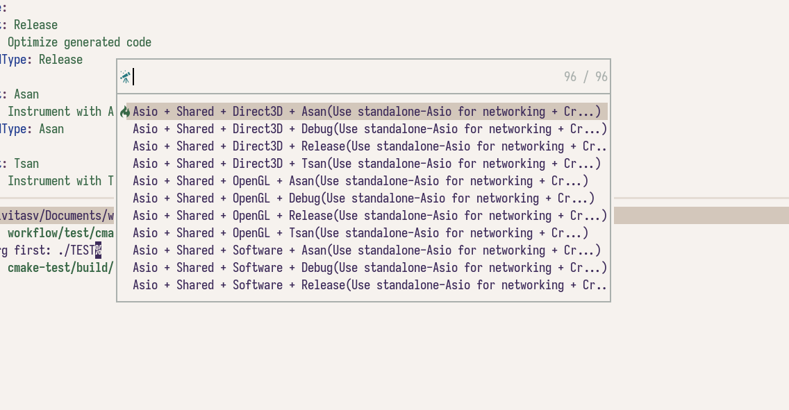

# CMake Variants

> Thanks [@toolcreator](https://github.com/toolcreator) for supporting CMake Variants.

CMake Variants is a concept of vscode-cmake-tools. It's used to group together and combine a common set of build options and give them a name.

Read more about cmake variants from [vscode-cmake-tools docs](https://github.com/microsoft/vscode-cmake-tools/blob/main/docs/variants.md).

If a variants file isn't preset, we load four default build types: Release, Debug, MinSizeRel and RelWithDebInfo.

[An Example](https://github.com/microsoft/vscode-cmake-tools/blob/main/docs/variants.md#large-variant-file-example) from vscode-cmake-tools:

```yaml
buildType:
  default: debug
  choices:
    debug:
      short: Debug
      long: Emit debug information
      buildType: Debug
    release:
      short: Release
      long: Optimize generated code
      buildType: Release
    asan:
      short: Asan
      long: Instrument with Address Sanitizer
      buildType: Asan
    tsan:
      short: Tsan
      long: Instrument with Thread Sanitizer
      buildType: Tsan

linkage:
  default: static
  choices:
    static:
      short: Static
      long: Create static libraries
      linkage: static
    shared:
      short: Shared
      long: Create shared libraries/DLLs
      linkage: shared

engine:
  default: ogl
  choices:
    ogl:
      short: OpenGL
      long: OpenGL rendering
      settings:
        ENGINE: OpenGL
    d3d:
      short: Direct3D
      long: Direct3D rendering
      settings:
        ENGINE: Direct3D
    vulkan:
      short: Vulkan
      long: Vulkan rendering
      settings:
        ENGINE: Vulkan
    software:
      short: Software
      long: Software rendering
      settings:
        ENGINE: Software

network:
  default: boost
  choices:
    boost:
      short: Boost.Asio
      long: Use Boost.Asio for networking
      settings:
        NETWORK: Boost
    asio:
      short: Asio
      long: Use standalone-Asio for networking
      settings:
        NETWORK: Asio
    net-ts:
      short: NetTS
      long: Use the C++ Networking TS for networking
      settings:
        NETWORK: net-ts
```

Then we you call `CMakeSelectBuildType`, it will look like this:



## TODO

1. Option `env` is not supported.
